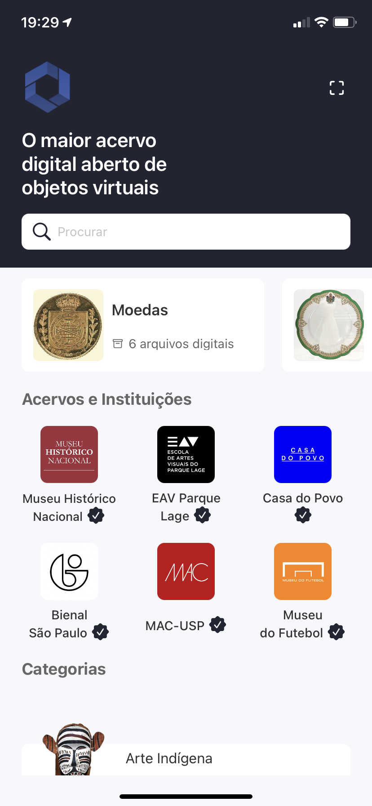
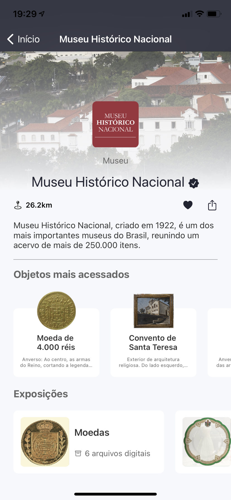
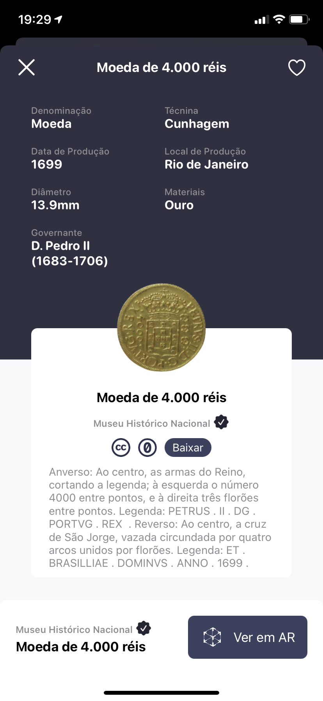
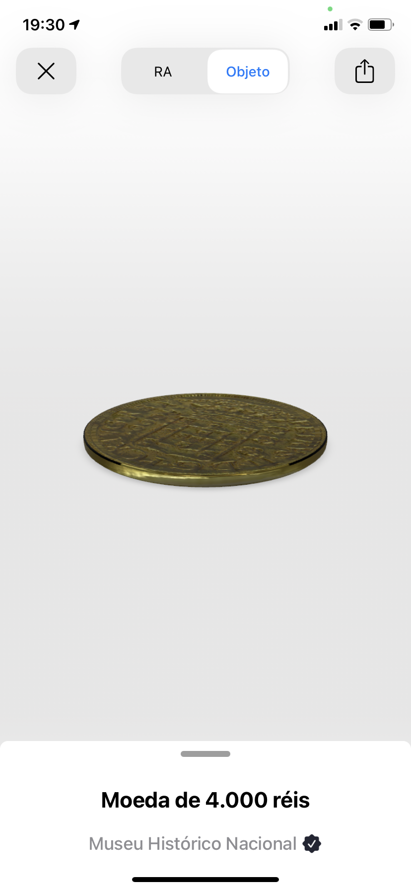
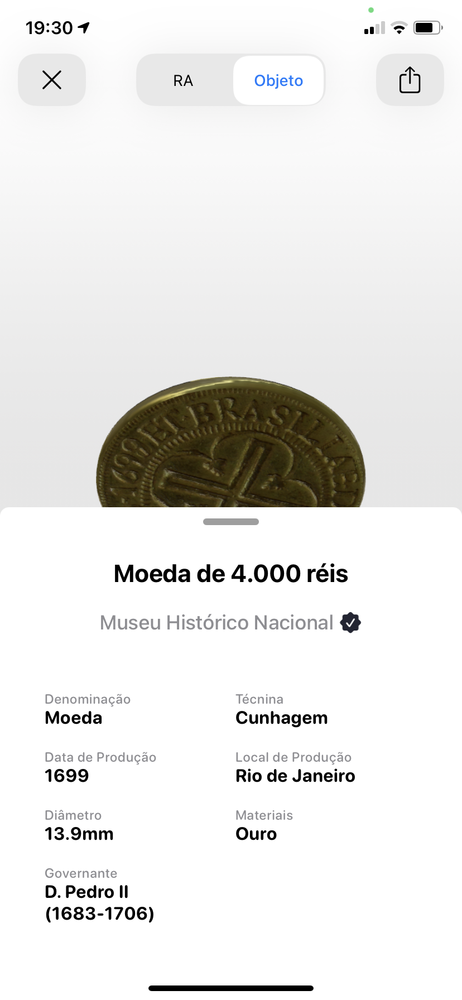

# Museália

[![CC BY-SA 4.0][cc-by-shield]][cc-by]

Este trabalho está licenciado com uma [Licença Creative Commons - Atribuição 4.0 Internacional][cc-by].

[![CC BY-SA 4.0][cc-by-image]][cc-by]

[cc-by]: http://creativecommons.org/licenses/by-sa/4.0/
[cc-by-image]: https://i.creativecommons.org/l/by/4.0/88x31.png
[cc-by-shield]: https://img.shields.io/badge/License-CC%20BY%204.0-lightgrey.svg

---

A Museália é uma plataforma que permite catalogar e experimentar com objetos tridimensionais  que fazem parte de um acervo ou museu de forma simples atráves de fotogrametria, tornando peças em exposição ou protegidas em reservas técnicas  acessíveis ao público.

---
## Capturas de tela do aplicativo

| Tela inicial | Página da Instituição Cultural |
|---|---|
|   |  |

| Página do Item | Item em Realidade Aumentada |
|---|---|
|   |  |

| Item em 3D | Item em 3D detalhado |
|---|---|
|   |  |
